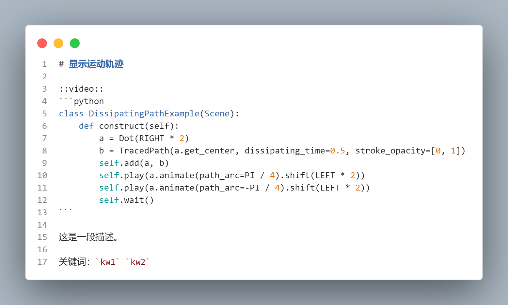

# Manim Example Gallery 

## 添加新例

在`src/`下创建新的Markdown文件，如`DissipatingPathExample.md`。内容分为四部分：
- 标题。将同时在本页面和目录中显示。
- 代码。`::video::`是一个占位符，下方代码将执行并渲染生成视频，视频会自动添加到此处。
- 描述。
- 关键词。



在`_toc.yml`中添加新的章节。

```yaml
chapters:
- file: src/DissipatingPathExample
```

执行下面的命令，以渲染静态网页。

```shell
python manage.py --file DissipatingPathExample.md --build
```

网页在`_build/html/`中，在浏览器中查看。

## 其他

```
$ python manage.py -h

usage: Manim-Example-Gallery Manager [-h] [-f [FILE ...]] [-i | --install | --no-install] [-b | --build | --no-build]
                                     [-d | --deploy | --no-deploy] [-c | --clean | --no-clean]

optional arguments:
  -h, --help            show this help message and exit
  -f [FILE ...], --file [FILE ...]
                        需要插入视频的Markdown文件（名），可为多个。默认检索src/下的所有.md文件
  -i, --install, --no-install
                        为开发环境安装依赖
  -b, --build, --no-build
                        根据markdown生成静态网页
  -d, --deploy, --no-deploy
                        部署。将html复制到“gh-pages”分支
  -c, --clean, --no-clean
                        清理全部临时文件
```